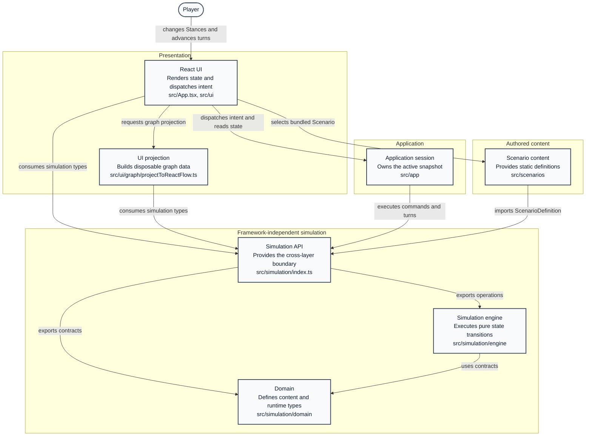
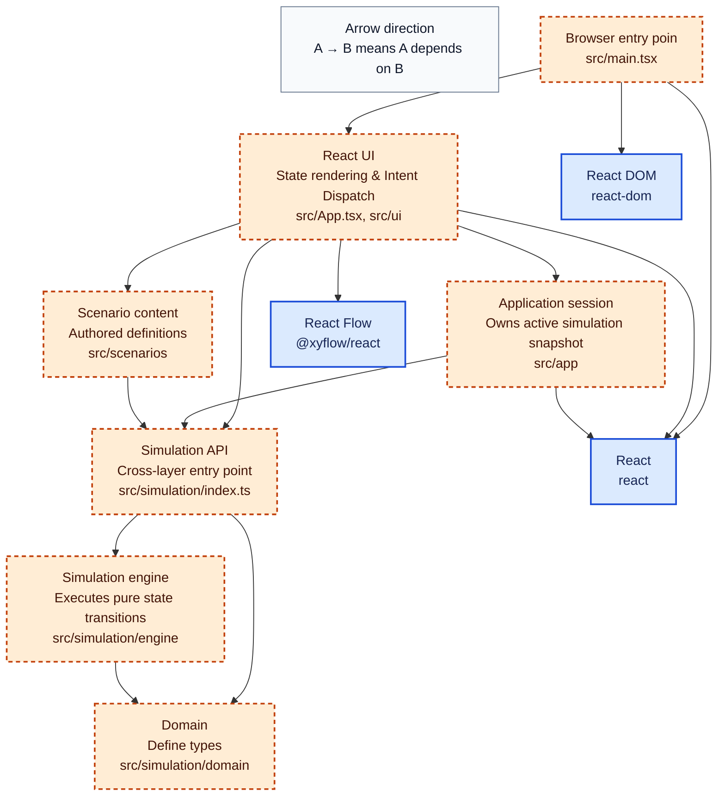

# Architecture

This document is authoritative for the intended software structure, module
responsibilities, and dependency boundaries. Game behavior belongs to
`GAME_DESIGN.md`; the content contract belongs to `DATA_FORMAT.md`.

## Architectural shape



The project is a client-side application with a deterministic, framework-free
simulation core. Keep this architecture direct: functions and plain data are
preferred over service containers, entity classes, event buses, or repository
abstractions without a demonstrated need.

## Modules

| Module                         | Current path                                                                                   | Responsibility                                                                                        |
| ------------------------------ | ---------------------------------------------------------------------------------------------- | ----------------------------------------------------------------------------------------------------- |
| Domain                         | `src/simulation/domain`                                                                        | Static definition types, runtime-state types, commands, and engine result types                       |
| Content loading and validation | Initially within `src/simulation`; extract a dedicated folder when multiple loaders warrant it | Parse or accept Scenario data, validate it, and produce trusted static definitions                    |
| Simulation engine              | `src/simulation/engine`                                                                        | Initialize runtime state and execute commands and turns as pure state transitions                     |
| Simulation public API          | `src/simulation/index.ts`                                                                      | Stable exports used outside the simulation package                                                    |
| Scenario content               | `src/scenarios`                                                                                | Authored static Scenario definitions; no runtime state or React code                                  |
| Application/session            | `src/app`                                                                                      | Own the active Scenario and runtime snapshot; inject runtime dependencies; coordinate load/reset/save |
| UI projections                 | `src/ui`                                                                                       | Derive presentation-ready data from definitions and runtime state                                     |
| React UI                       | `src/App.tsx` and UI components                                                                | Render state and dispatch semantic commands                                                           |
| Persistence adapter            | Not yet implemented                                                                            | Serialize and restore versioned session data without changing engine semantics                        |

Folder names may evolve, but the responsibilities and dependency direction are
the constraint.

## Dependency

Allowed dependencies:



Rules:

- The domain and engine MUST NOT import React, React Flow, browser APIs, UI
  types, persistence adapters, or application session code.
- Scenario content MUST NOT import UI or mutate runtime state.
- UI code MUST dispatch commands through the engine boundary; it MUST NOT
  implement game transitions.
- React Flow nodes, edges, positions, and interaction state are disposable view
  data, never canonical simulation state.
- Lower layers MUST NOT call upward through callbacks to application or UI
  modules.
- Cross-layer imports should use the simulation public API unless code is
  internal to the simulation package.

## Static definitions and runtime state

Static Scenario definitions are immutable authored content. Runtime state is an
immutable snapshot that changes during play. They may reference the same stable
IDs but MUST remain distinct representations.

The engine receives both explicitly:

```ts
initializeScenario(scenario) -> state
executeCommand(scenario, state, command) -> command result
advanceTurn(scenario, state, runtime dependencies) -> turn result
```

An engine transition returns a new snapshot and leaves its inputs unchanged.
Derived UI objects and calculation traces do not become fields in the canonical
Scenario definition.

## Scenario loading

Scenario is the only top-level playable configuration. A loading boundary must:

1. obtain a JSON-compatible Scenario definition, whether imported at build time
   or parsed at runtime;
2. validate shape, identifiers, references, domains, and type-specific rules;
3. reject invalid content with actionable diagnostics;
4. return a trusted definition to initialization.

The current compiled TypeScript Scenario may continue as a source while there
is only local bundled content. Adding runtime files or remote content should add
a parser at this boundary, not change the engine to accept unvalidated data.
Normalization may fill representation-level defaults defined by
`DATA_FORMAT.md`; it MUST NOT invent game behavior.

## State ownership and commands

Exactly one application/session owner holds the active runtime snapshot. In the
browser MVP this is a React hook. Components receive state or narrow view
models and dispatch intent through commands such as setting a Stance or
resolving a Dilemma.

The session layer owns:

- which validated Scenario is active;
- the latest runtime snapshot;
- command and turn orchestration;
- injection of RNG and other explicit runtime dependencies;
- transient user feedback;
- future save/load coordination.

It does not calculate Effects, apply costs, resolve incidents, or otherwise
duplicate mechanics.

## Simulation flow

Initialization:

```text
load Scenario -> validate -> create authoritative turn-zero snapshot
              -> seed per-Effect runtime history
```

Player action:

```text
UI intent -> semantic command -> validate against Scenario and state
          -> accepted next snapshot or rejected unchanged snapshot
```

Turn advancement:

```text
Scenario + prior snapshot + injected RNG
    -> pure engine transition
    -> next snapshot + trace/messages
```

The engine uses the synchronous prior-snapshot model and other partial ordering
rules in `GAME_DESIGN.md`. The unresolved complete phase order must remain
localized in the turn orchestrator so it can be settled without changing UI or
content ownership.

Incident candidate calculation and incident selection should be separable
engine steps. This is required because the selection policy is still a design
TBD, not because it warrants a general rules framework.

### Engine functions

This is an implementation reference for `src/simulation/engine`, including
private helpers. It describes current code rather than adding game semantics;
`GAME_DESIGN.md` remains authoritative.

| Function                                                  | Visibility      | Current flow                                                                                                                                       |
| --------------------------------------------------------- | --------------- | -------------------------------------------------------------------------------------------------------------------------------------------------- |
| `advanceTurn`<br>`advanceTurn.ts`                         | Public          | 1. Increment turn/year. <br>2. Evaluate persistence. <br>3. Decay and clean up Grudges. <br>4. Return state, message, and trace.                   |
| `responseValue`<br>`evaluatePersistentState.ts`           | Private         | 1. Select response kind. <br>2. Calculate its contribution.                                                                                        |
| `evaluateEffect`<br>`evaluatePersistentState.ts`          | Private         | 1. Read source. <br>2. Update inertia history. <br>3. Average and evaluate response.                                                               |
| `evaluatePersistentState`<br>`evaluatePersistentState.ts` | Engine-internal | 1. Evaluate Effects from one snapshot. <br>2. Recalculate non-Stances. <br>3. Clamp and apply Situation hysteresis. <br>4. Return state and trace. |
| `initializeScenario`<br>`initialize.ts`                   | Public          | 1. Validate. <br>2. Create runtime nodes. <br>3. Seed inertia histories. <br>4. Return turn-zero state.                                            |
| `validateScenario`<br>`validateScenario.ts`               | Public          | 1. Collect diagnostics. <br>2. Check IDs, domains, values, thresholds, references, and costs. <br>3. Return all errors.                            |
| `reject`<br>`playerActions.ts`                            | Private         | 1. Create a rejected result. <br>2. Preserve the original state. <br>3. Include the message.                                                       |
| `changeStance`<br>`playerActions.ts`                      | Private         | 1. Validate value and prerequisites. <br>2. Check/debit cost. <br>3. Set value and baseline. <br>4. Add history and accept.                        |
| `executeCommand`<br>`playerActions.ts`                    | Public          | 1. Verify Scenario ownership. <br>2. Dispatch and type-check the Stance. <br>3. Delegate to `changeStance`.                                        |
| `indexNodes`<br>`shared.ts`                               | Engine-internal | 1. Iterate node definitions. <br>2. Return an ID-keyed lookup.                                                                                     |
| `clampValue`<br>`shared.ts`                               | Engine-internal | 1. Return unchanged when disabled. <br>2. Otherwise bound to the node domain.                                                                      |

`src/simulation/index.ts` declares no functions. It re-exports the public
operations `advanceTurn`, `initializeScenario`, `executeCommand`, and
`validateScenario`, along with domain contracts.

## React and React Flow

React renders the current application snapshot and dispatches commands. Hooks
may memoize projections but must not become an alternate simulation store.

The graph adapter maps visible simulation nodes and Effects to React Flow data:

- definition data supplies labels and visibility;
- runtime data supplies values, activation, and current contributions;
- layout and styling remain presentation concerns;
- hidden nodes and edges continue participating in simulation;
- dragging or selecting a graph element does not mutate game state unless
  translated into an explicit supported command.

Scenario-specific assumptions such as a fixed year, one Resource, or one
particular Scenario do not belong in reusable UI components.

## Persistence boundary

Persistence is not required for the current MVP. When introduced, it belongs
behind the application/session layer and stores:

- a format version;
- Scenario identity and compatible content version;
- canonical runtime state;
- deterministic replay data only if replay is supported.

Do not persist React state, React Flow objects, cached projections, or function
references. Loading must validate and, when necessary, explicitly migrate saved
data before passing it to the engine. The engine itself remains independent of
storage technology.

## Architectural invariants

1. `GAME_DESIGN.md` semantics are implemented only in the simulation layer.
2. Static definitions, runtime state, and UI projections are separate.
3. The engine is pure except for explicitly injected nondeterminism.
4. State transitions are immutable and deterministic for equal inputs.
5. Authored content is validated before initialization.
6. IDs, not object identity or UI labels, connect content and runtime state.
7. React and React Flow remain replaceable consumers of the simulation API.
8. Visibility never controls simulation participation.
9. Persistence is an outer adapter, not an engine responsibility.
10. Unresolved design choices remain localized and are not encoded across
    multiple layers.

## MVP assessment and migration gaps

Retain:

- the domain/engine/UI separation;
- pure snapshot-returning engine functions;
- the narrow simulation entry point;
- injected RNG support;
- Scenario content outside the engine;
- projection of React Flow data from canonical state;
- engine tests that run without a browser.

Improve as relevant work reaches these areas:

- initialization currently recalculates nodes immediately, conflicting with
  authoritative turn-zero values;
- incident evaluation currently fires every eligible Event and then the first
  eligible Dilemma, conflicting with the one-incident rule and unresolved
  selection policy;
- the compiled example is wired directly into `App.tsx` rather than selected
  through a Scenario-loading/session boundary;
- deterministic RNG construction is embedded in a React hook rather than
  supplied by an application runtime dependency;
- reusable UI contains Scenario-specific assumptions about year and Resource
  count;
- no persistence or content/save version boundary exists;
- the public simulation barrel exposes internal runtime and definition details
  broadly; keep exports intentional as the codebase grows;
- engine tests compile but their emitted extensionless ESM imports do not
  execute under the current Node configuration.

These gaps document migration direction. They do not authorize unrelated
refactors or resolution of mechanics marked TBD.
