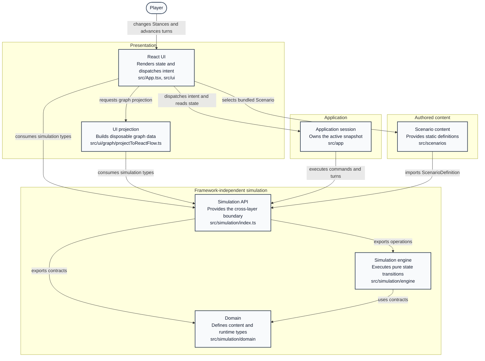
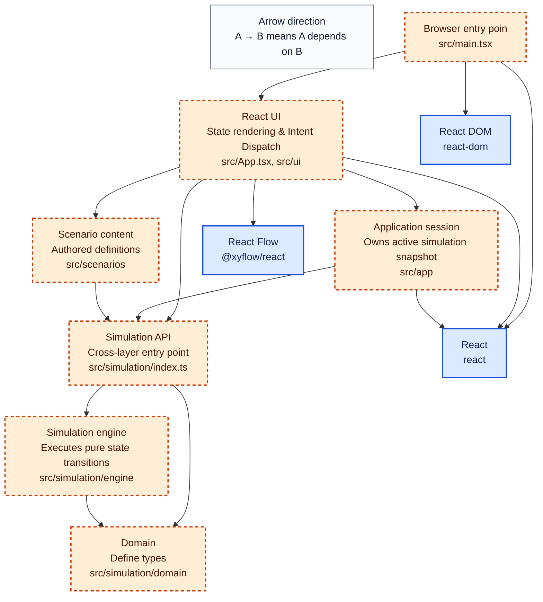

# Architecture

This document is authoritative for the intended software structure, module
responsibilities, and dependency boundaries. Game behavior belongs to
`GAME_DESIGN.md`; the content contract belongs to `DATA_FORMAT.md`.

## Architectural shape


```mermaid
flowchart TB
  PLAYER(["Player"]):::person

  subgraph PRESENTATION["Presentation"]
    direction TB
    UI["React UI<br/>Renders state and dispatches intent<br/>src/App.tsx, src/ui"]:::component
    PROJECTION["UI projection<br/>Builds disposable graph data<br/>src/ui/graph/projectToReactFlow.ts"]:::component
  end

  subgraph APPLICATION["Application"]
    SESSION["Application session<br/>Owns the active snapshot<br/>src/app"]:::component
  end

  subgraph AUTHORED_CONTENT["Authored content"]
    CONTENT["Scenario content<br/>Provides static definitions<br/>src/scenarios"]:::component
  end

  subgraph SIMULATION["Framework-independent simulation"]
    direction TB
    API["Simulation API<br/>Provides the cross-layer boundary<br/>src/simulation/index.ts"]:::component
    ENGINE["Simulation engine<br/>Executes pure state transitions<br/>src/simulation/engine"]:::component
    DOMAIN["Domain<br/>Defines content and runtime types<br/>src/simulation/domain"]:::component
  end

  PLAYER -->|"changes Stances and advances turns"| UI
  UI -->|"selects bundled Scenario"| CONTENT
  UI -->|"dispatches intent and reads state"| SESSION
  UI -->|"consumes simulation types"| API
  UI -->|"requests graph projection"| PROJECTION
  PROJECTION -->|"consumes simulation types"| API
  SESSION -->|"executes commands and turns"| API
  CONTENT -->|"imports ScenarioDefinition"| API
  API -->|"exports operations"| ENGINE
  API -->|"exports contracts"| DOMAIN
  ENGINE -->|"uses contracts"| DOMAIN

  classDef person fill:#f8fafc,stroke:#475569,color:#0f172a,stroke-width:2px
  classDef component fill:#f8fafc,stroke:#334155,color:#0f172a,stroke-width:2px
```

The project is a client-side application with a deterministic, framework-free
simulation core.

## Modules

| Module                         | Current path                                                                                   | Responsibility                                                                                        |
| ------------------------------ | ---------------------------------------------------------------------------------------------- | ----------------------------------------------------------------------------------------------------- |
| Domain                         | `src/simulation/domain`                                                                        | Static definition types, runtime-state types, commands, and engine result types                       |
| Content loading and validation | Initially within `src/simulation`; extract a dedicated folder when multiple loaders warrant it | Parse or accept Scenario data, validate it, and produce trusted static definitions                    |
| Simulation engine              | `src/simulation/engine`                                                                        | Initialize runtime state and execute commands and turns as pure state transitions                     |
| Simulation public API          | `src/simulation/index.ts`                                                                      | Stable exports used outside the simulation package                                                    |
| Scenario content               | `src/scenarios`                                                                                | Authored static Scenario definitions; no runtime state or React code                                  |
| Application/session            | `src/app`                                                                                      | Own the active Scenario and runtime snapshot; inject runtime dependencies; coordinate load/reset/save |
| UI projections                 | `src/ui`                                                                                       | Derive presentation-ready data from definitions and runtime state                                     |
| React UI                       | `src/App.tsx` and UI components                                                                | Render state and dispatch semantic commands                                                           |
| Persistence adapter            | `src/app/persistence.ts`                                                                       | Validate, serialize, restore, and clear versioned browser saves without changing engine semantics     |

Folder names may evolve, but the responsibilities and dependency direction are
the constraint.

## Dependency

Allowed dependencies:


```mermaid
flowchart TB
  KEY["Arrow direction<br/>A → B means A depends on B"]:::key

  BOOT["Browser entry poin<br/>src/main.tsx"]:::custom
  UI["React UI<br/>State rendering & Intent Dispatch<br/>src/App.tsx, src/ui"]:::custom
  SESSION["Application session<br/>Owns active simulation snapshot<br/>src/app"]:::custom
  CONTENT["Scenario content<br/>Authored definitions<br/>src/scenarios"]:::custom
  API["Simulation API<br/>Cross-layer entry point<br/>src/simulation/index.ts"]:::custom
  ENGINE["Simulation engine<br/>Executes pure state transitions<br/>src/simulation/engine"]:::custom
  DOMAIN["Domain<br/>Define types<br/>src/simulation/domain"]:::custom

  REACT["React<br/>react"]:::ootb
  REACT_DOM["React DOM<br/>react-dom"]:::ootb
  REACT_FLOW["React Flow<br/>@xyflow/react"]:::ootb

  BOOT --> UI
  BOOT --> REACT
  BOOT --> REACT_DOM

  UI --> SESSION
  UI --> CONTENT
  UI --> API
  UI --> REACT
  UI --> REACT_FLOW

  SESSION --> API
  SESSION --> REACT
  CONTENT --> API

  API --> ENGINE
  API --> DOMAIN
  ENGINE --> DOMAIN

  classDef ootb fill:#dbeafe,stroke:#1d4ed8,color:#172554,stroke-width:2px
  classDef custom fill:#ffedd5,stroke:#c2410c,color:#431407,stroke-width:2px,stroke-dasharray:5 4
  classDef key fill:#f8fafc,stroke:#64748b,color:#0f172a,stroke-width:1px
```

Rules:

- The domain and engine MUST NOT import React, React Flow, browser APIs, UI
  types, persistence adapters, or application session code.
- Scenario content MUST NOT import UI or mutate runtime state.
- UI code MUST dispatch commands through the engine boundary; it MUST NOT
  implement game transitions.
- React Flow nodes, edges, positions, and interaction state are disposable view
  data, never canonical simulation state.
- Lower layers MUST NOT call upward through callbacks to application or UI
  modules.
- Cross-layer imports should use the simulation public API unless code is
  internal to the simulation package.

## Static definitions and runtime state

Static Scenario definitions are immutable authored content. Runtime state is an
immutable snapshot that changes during play. They may reference the same stable
IDs but MUST remain distinct representations.

The engine receives both explicitly:

```ts
initializeScenario(scenario) -> state
executeCommand(scenario, state, command) -> command result
advanceTurn(scenario, state, runtime dependencies) -> turn result
```

An engine transition returns a new snapshot and leaves its inputs unchanged.
Derived UI objects and calculation traces do not become fields in the canonical
Scenario definition.

## Scenario loading

Scenario is the only top-level playable configuration. A loading boundary must:

1. obtain a JSON-compatible Scenario definition, whether imported at build time
   or parsed at runtime;
2. validate shape, identifiers, references, domains, and type-specific rules;
3. reject invalid content with actionable diagnostics;
4. return a trusted definition to initialization.

The current loading path is:

```text
untrusted content -> validateScenario -> structured clone and normalize
                   -> freeze trusted Scenario -> initialize turn-zero state
```

The current compiled TypeScript Scenario may continue as a source while there
is only local bundled content. Adding runtime files or remote content should add
a parser at this boundary, not change the engine to accept unvalidated data.
Normalization may fill representation-level defaults defined by
`DATA_FORMAT.md`; it MUST NOT invent game behavior.

## State ownership and commands

Exactly one application/session owner holds the active runtime snapshot. In the
browser MVP this is a React hook. Components receive state or narrow view
models and dispatch intent through commands such as setting a Stance or
resolving a Dilemma.

The session layer owns:

- which validated Scenario is active;
- the latest runtime snapshot;
- command and turn orchestration;
- injection of RNG and other explicit runtime dependencies;
- transient user feedback;
- save/load coordination.

It does not calculate Effects, apply costs, resolve incidents, or otherwise
duplicate mechanics.

## Simulation flow

Initialization:

```text
initializeScenario
    -> loadScenario validates, normalizes, and freezes the Scenario
    -> create turn-zero node values and history
    -> seed Effect histories and initial Resource netFlow
```

Player action:

```text
UI intent -> command -> assess against Scenario and current snapshot
                     -> accepted immutable snapshot or unchanged rejection
```

Turn advancement:

```text
advanceTurn(scenario, state, optional randomValue)
    -> reject terminal or pending-Dilemma snapshots
    -> increment turn/year
    -> evaluatePersistentState from one prior snapshot
    -> decay Grudges after they contribute
    -> evaluateGameOvers on the post-persistent, post-decay snapshot
         terminal -> record outcome; incident selectors return no candidates
         nonterminal -> advance episodes; apply any stage/recovery consequences
    -> select Events and queue at most one Dilemma from the post-Game-Over state
    -> apply captured Event consequences in Event ID order
    -> record post-Event node history
    -> resolve an Ending if eligible (skipped for terminal or pending states)
    -> return next snapshot, trace, and messages
```

The engine uses the synchronous prior-snapshot model and other partial ordering
rules in `GAME_DESIGN.md`. The unresolved complete phase order must remain
localized in the turn orchestrator so it can be settled without changing UI or
content ownership.

A Resource combines a stored balance with recurring Effect and Grudge flows,
plus direct transactions.

`initializeScenario` seeds turn-zero `netFlow`, and `advanceTurn` delegates
ongoing evaluation to `evaluatePersistentState`. Runtime `value` stores the
balance; `netFlow` stores persistent Effect and Grudge contributions.

Player commands are validated in `playerActions.ts`; `executeCommand` commits
accepted Stance costs using `debitCost`. Event and Dilemma resolution delegate
Resource consequences to `applyConsequences`. These modules implement the rules
in `GAME_DESIGN.md`. UI projections read `value` and `netFlow`, and persistence
validates both fields in saves.

Any future gradual Stance implementation or minister-like influence must be
modeled and calculated by the simulation engine through its public API. The
UI, session, and persistence layers MUST NOT duplicate those rules; define
their exact responsibilities once the mechanics and data contract are
specified.

`selectEvents` and `queueDilemmas` evaluate candidates from the same post-Game-Over snapshot. `queueDilemmas` records at most one selected Dilemma.
Captured Event consequences are then applied in ID order. `resolveEnding` runs after Event resolution and skips terminal or pending-Dilemma states. Resolving a Dilemma applies its choice but does not recalculate persistent values or resolve an Ending.

`conditionsMet` checks static Scenario tags; `matchingPrerequisiteGroups`
evaluates runtime groups against a snapshot. These helpers do not choose
timing: `evaluateGameOvers` checks before incident selection, and
`resolveEnding` checks completion after Event handling.

### Engine functions

This is an implementation reference for `src/simulation/engine`, including
private helpers. It describes current code rather than adding game semantics;
`GAME_DESIGN.md` remains authoritative.

| Function                                                              | Visibility      | Responsibility                                                                                                                                                                                            |
| --------------------------------------------------------------------- | --------------- | --------------------------------------------------------------------------------------------------------------------------------------------------------------------------------------------------------- |
| `loadScenario`                                                        | Public          | Validate, normalize, clone, and freeze Scenario content.                                                                                                                                                  |
| `initializeScenario`                                                  | Public          | Build turn-zero state, clamp initial Resources, seed Effect histories and Resource flow, and record initial node history.                                                                                 |
| `advanceTurn`                                                         | Public          | Guard terminal/pending states, increment time, orchestrate the turn, and return the next snapshot and persistent trace.                                                                                   |
| `evaluatePersistentState`                                             | Engine-internal | Clamp configured Resource balances; sample Effects from one snapshot; update eligible nodes, sum constraints, and Situation activation; return a trace. Newly active Situations source Effects next turn. |
| `evaluateGameOvers`                                                   | Engine-internal | Read the post-persistent, post-decay snapshot; record terminal causes or apply nonterminal stage/recovery consequences.                                                                                   |
| `selectEvents` / `queueDilemmas`                                      | Engine-internal | Capture eligible incidents from the same post-Game-Over snapshot; queue at most one Dilemma.                                                                                                              |
| `resolveEvents` / `resolveDilemma`                                    | Engine-internal | Apply selected Event consequences or a Dilemma choice without rerunning persistent evaluation.                                                                                                            |
| `resolveEnding`                                                       | Engine-internal | Check completion and record the highest-priority eligible Ending or fallback, unless terminal or awaiting a Dilemma.                                                                                      |
| `assessStanceChange` / `assessStanceEnactment` / `assessStanceRepeal` | Public          | Check Stance actions against one Scenario and runtime snapshot.                                                                                                                                           |
| `executeCommand`                                                      | Public          | Reassess and commit an accepted Stance or Dilemma command as an immutable state update.                                                                                                                   |
| `applyConsequences`                                                   | Engine-internal | Apply Resource, Grudge, or activation consequences for one occurrence.                                                                                                                                    |

`src/simulation/index.ts` re-exports the public engine operations and domain
contracts, including loading, Stance assessment, and Effect preview helpers.

## React and React Flow

React renders the current application snapshot and dispatches commands. Hooks
may memoize projections but must not become an alternate simulation store.

local dossier-navigation state controls overlapping dialogs and is never persisted.

The graph adapter maps visible simulation nodes and Effects to React Flow data:

- definition data supplies labels and visibility;
- runtime data supplies values, isActive, isForced, and current contributions;
- Faction groups and metric labels are static Scenario metadata; Faction nodes share the normal numeric engine path and groups MAY NOT have runtime state;
- shared UI ownership indexes project one card per group, map both Effect endpoints, and expose metrics in graph and dossier selectors;
- layout and styling remain presentation concerns;
- hidden nodes and edges continue participating in simulation;
- dragging or selecting a graph element does not mutate game state unless
  translated into an explicit supported command.

Scenario-specific assumptions such as a fixed year, one Resource, or one
particular Scenario do not belong in reusable UI components.

## Scenario catalog and persistence boundary

The application presents playable content through a Scenario catalog. Each catalog entry contains untrusted Scenario content plus a positive integer `contentVersion`. The loading boundary validates the content before the launcher displays it. The catalog version belongs to application compatibility.

Browser persistence belongs behind the application/session layer and stores:

- a format version;
- Scenario identity and compatible content version;
- canonical runtime state;
- player and denomination display identity;
- the validated player-facing Turn report record for the saved turn, when one is available;
- deterministic replay data only if replay is supported.

Do not persist React state, React Flow objects, arbitrary cached projections, or function references.
The Turn report record is an explicit player-facing save record, keyed by Scenario IDs and rehydrated into a UI projection after load.
Loading MUST validate saved data before passing runtime state to the engine.
The MVP uses only the current save slot and rejects incompatible formats without migration.
The engine remains independent of storage technology.

The current browser adapter owns one versioned local save slot. It validates the save format, identity limits, Scenario and catalog-version compatibility, and the complete canonical runtime snapshot histories, before offering restoration.
Validation checks structure, references, and runtime invariants.
Invalid or incompatible saves are never passed to the session or engine.

## Architectural invariants

1. `GAME_DESIGN.md` semantics are implemented only in the simulation layer.
2. Static definitions, runtime state, and UI projections are separate.
3. The engine is pure except for explicitly injected nondeterminism.
4. State transitions are immutable and deterministic for equal inputs.
5. Authored content is validated before initialization.
6. IDs, not object identity or UI labels, connect content and runtime state.
7. React and React Flow remain replaceable consumers of the simulation API.
8. Visibility never controls simulation participation.
9. Persistence is an outer adapter, not an engine responsibility.
10. Unresolved design choices remain localized and are not encoded across
    multiple layers.

## MVP assessment and migration gaps

Retain:

- the domain/engine/UI separation;
- pure snapshot-returning engine functions;
- the narrow simulation entry point;
- Scenario content outside the engine;
- projection of React Flow data from canonical state;
- engine tests that run without a browser.

Improve as relevant work reaches these areas:

- incident candidate evaluation and selection remain localized in the turn orchestrator;
- keep public simulation exports intentional as the codebase grows.

These gaps document migration direction. They do not authorize unrelated
refactors or resolution of mechanics marked TBD.
